# Super Mario DQN —— 超级马里奥场景下的 DQN 强化学习实验

本仓库是深度强化学习课程实践作业：在 OpenAI Gym 的 `gym-super-mario-bros` 环境中，用 DQN（Deep Q-Network）训练马里奥智能体从像素画面中学习通关策略。

作业要求补全 `agent.py` 中 DQN 的三个核心函数，本项目在补全的基础上，还完成了从短周期探索、基准测试到全量级长周期训练的完整实验，并对训练过程中遇到的显存溢出、采样变慢等问题做了多轮优化尝试——其中部分改动在后续实验中暴露出了问题，相关反思也如实记录在本文与实验报告中。

## 目录

- [核心算法](#核心算法)
- [实验过程（完整记录）](#实验过程完整记录)
- [快速开始](#快速开始)
- [目录结构](#目录结构)
- [文档](#文档)

## 核心算法

DQN 用深度神经网络拟合 Q 函数 `Q(s, a)`，即"在状态 `s` 下执行动作 `a` 的期望累计回报"。智能体通过与环境的交互不断收集经验 `(s, a, r, s')`，并用这些经验反复更新网络参数。本项目使用 online / target 双网络：online 网络负责选择动作和估计 Q 值，target 网络（参数冻结、周期性同步）负责计算训练目标，以缓解训练震荡。

### 三个核心公式

本次作业的核心是补全 `agent.py` 中的三个函数，分别对应 DQN 训练的"估计 → 目标 → 更新"三步：

**1. Q 值估计（`td_estimate`）**

由 online 网络对当前状态 `s` 输出所有动作的 Q 值表，再按实际执行的动作 `a` 取出对应的分数：

```
Q_est = Q_online(s, a)
```

对应代码：[agent.py](agent.py) 的 `td_estimate()`。

**2. TD 目标（`td_target`）**

```
y = r + (1 - done) * gamma * max_a' Q_target(s', a')
```

- `r`：环境对 `(s, a)` 返回的即时奖励；
- `done`：是否终止，终止时不再向后看；
- `gamma`：折扣因子（本项目取 0.9）；
- `max_a' Q_target(s', a')`：target 网络对下一状态 `s'` 所有动作给出的最高 Q 值。

对应代码：[agent.py](agent.py) 的 `td_target()`（在 `@torch.no_grad()` 下计算）。

**3. 参数更新（`update_Q_online`）**

用损失函数衡量估计值与目标值的差距，并完成一次梯度更新：

```
loss = SmoothL1(Q_est, y)
loss -> zero_grad -> backward -> step
```

对应代码：[agent.py](agent.py) 的 `update_Q_online()`。

### 网络结构（`neural.py` / MarioNet）

- 输入：4 帧堆叠的 84×84 灰度图像，形状 `(4, 84, 84)`；
- 卷积部分：3 层 Conv2d + ReLU（32 @ 8×8/stride 4 → 64 @ 4×4/stride 2 → 64 @ 3×3/stride 1）；
- 全连接部分：Flatten → 3136 → 512 → 动作数；
- 双网络：`online` 与 `target` 结构相同，target 参数冻结，每 `sync_every` 步从 online 同步一次。

### 环境预处理（`wrappers.py`）

`make_env()` 的预处理流水线：

1. `JoypadSpace`：动作空间压缩为 2 个按键组合（`[右]`、`[右+A]`）；
2. `SkipFrame(4)`：每 4 帧执行一次动作；
3. `GrayScaleObservation`：RGB 转灰度；
4. `ResizeObservation(84)`：缩放至 84×84；
5. `NormalizeObservation`：归一化到 `[0, 1]`；
6. `FrameStack(4)`：堆叠最近 4 帧作为状态。

### 训练流程（`main.py` + `agent.py`）

- ε-greedy 探索：初始 ε=1.0，每步乘以 `exploration_rate_decay`，下限 0.1；
- 经验回放：环形缓冲区实现（容量 100000），前 `burnin` 步只积累经验不学习；
- 每 `learn_every` 步学习一次，batch size 64；每 `sync_every` 步同步 target 网络；
- 随机种子：`--seed` 固定 Python / NumPy / PyTorch 随机源（gym 环境内部随机性未固定，`main.py` 中保留注释）；
- 断点续训：`--checkpoint` 可恢复模型参数、ε 与步数继续训练。

### 超参数（当前默认）

| 参数 | 值 |
| --- | --- |
| 经验池容量 | 100000 |
| batch size | 64 |
| gamma | 0.9 |
| ε 初始 / 下限 | 1.0 / 0.1 |
| exploration_rate_decay | 0.99999975 |
| burnin | 10000 |
| learn_every | 3 |
| sync_every | 10000 |
| save_every | 100000 |
| 优化器 | Adam（lr=0.00025） |
| 损失函数 | SmoothL1Loss |

## 实验过程（完整记录）

实验共分四个阶段，从 100 轮短周期探索逐步过渡到 7000+ 轮全量级长周期训练，最终累计约 7500 轮、82 万步。各阶段总览：

| 实验 | 训练量 | 目的 | 关键结论 |
| --- | --- | --- | --- |
| 实验一 | 100 episodes × 2 | 验证代码正确性 | 指标波动剧烈，Q 值平滑上升 |
| 实验二 | 100 episodes | 固定种子建立基准 | 曲线与实验一一致，可复现；GPU 利用率仅 ~1% |
| 实验三 | 1000 episodes | 参数调优 + 解决显存溢出 | Length 下降而 Reward 稳定，策略变高效 |
| 实验四 | 7000+ episodes | 全量级长周期训练 | 震荡严重未收敛，但 Reward 中心线上移 |

### 实验一：短周期探索性训练（100 episodes）

用于验证 DQN 代码与环境配置的基本可用性。共跑两次：第一次每 20 轮记录一次日志，第二次改为每轮打印以观察更多细节。

由于 ε 处于较高水平、智能体以随机探索为主，`Mean Length` 与 `Mean Reward` 波动剧烈。一个值得注意的现象是：训练前 50 轮 `Mean Length` 反而呈上升趋势——分析认为这是经验池初期样本过少且质量参差，极端数据对均值影响显著；随着样本增多，影响被稀释，指标回归中心线附近波动。Q 值呈现平滑上升，是因为 Q 与 loss 先在一个 episode 内对所有学习步平均、再对最近 100 个 episode 二次平均，双重平滑让曲线更稳定。

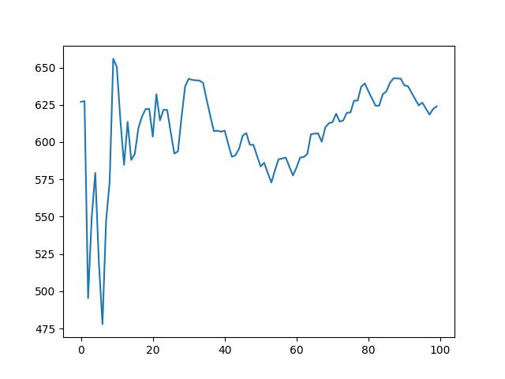
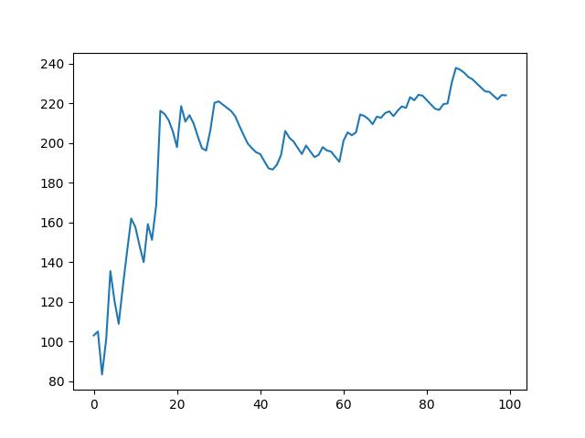

### 实验二：固定随机种子的基准测试（100 episodes）

为保证实验可复现，在 `main.py` 中加入了随机种子设定，再跑 100 轮作为基准对照。曲线与实验一基本一致，验证了训练过程的确定性，也再次印证了"初期经验池样本不足导致均值被压低"的判断。

此外观察到 GPU 占用率仅约 1%，分析原因为：batch size 较小、经验池采样频率不高、`learn_every` 导致学习间隔较长——这为后续实验的调参方向提供了线索。

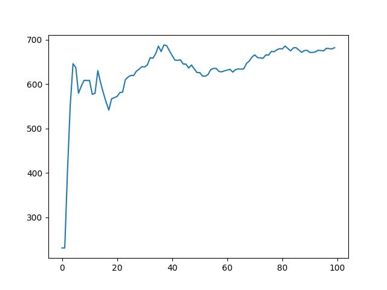

### 实验三：中等周期参数调优训练（1000 episodes）

在长周期训练前先做一轮 1000 轮模拟，适配两个关键参数，使 ε 在 1000 轮内衰减到 0.1，以对标 10000 轮训练的中后期状态：

| 参数 | 调整前 | 调整后 |
| --- | --- | --- |
| save_every | 500000 | 50000 |
| exploration_rate_decay | 0.99999975 | 0.999885 |

训练到 300+ 轮时出现显存溢出（OOM），定位为经验池数据全部存放在 GPU 上，将经验池迁移至 CPU 内存、仅在采样后（`recall` 时）搬到 GPU 后解决，重跑后成功完成 1000 轮。

结果：`Loss` 与 Q 值平稳上升；`Reward` 度过初期极端数据影响后围绕中心线波动；`Length` 呈下降趋势——智能体用更少的步数拿到了相近的奖励，说明策略在向更高效率演化，这是积极的信号。

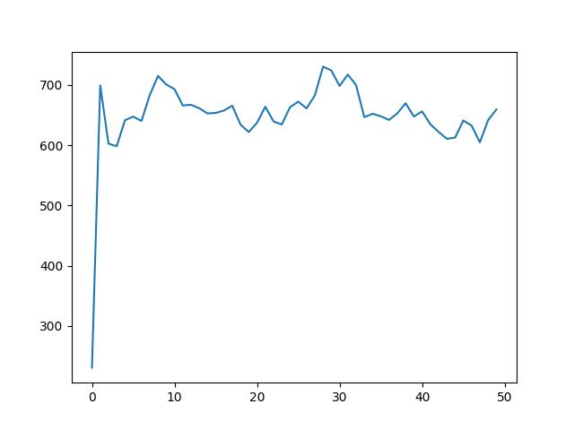
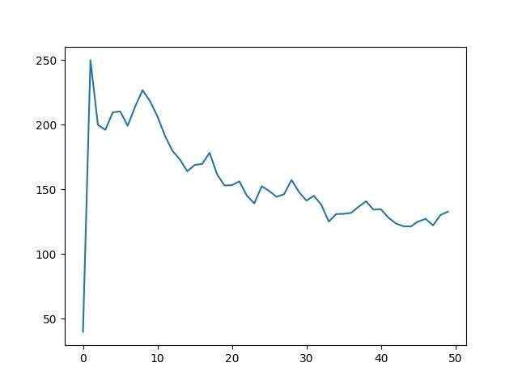
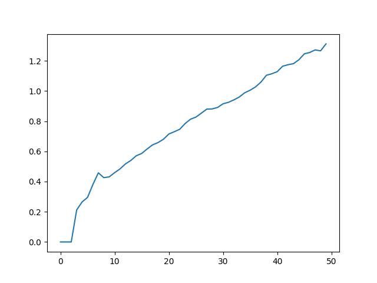
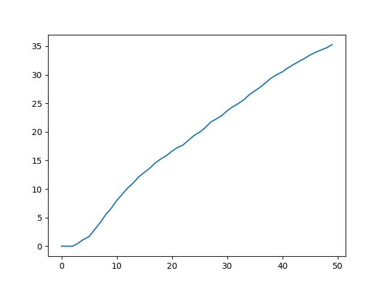

### 实验四：长周期训练（最终 7000+ episodes）

原定目标为完成 10000+ episodes，实际分两个阶段：

**第一阶段（约 2000+ 轮，日志记录 3180 轮 / 约 65 万步）**：受训练速度限制（约 5 分钟 20 轮，一晚约 2000+ 轮）只完成了部分训练。过程中发现两个问题：一是经验池越大，`random.sample(deque)` 的随机采样耗时越严重；二是池中积累了大量的早期样本，当时认为"低质量数据不利于自我增强"。

基于以上判断，对经验池进行了重构优化（即代码注释中的"策略C"）：用环形缓冲区（List 实现，随机访问 O(1)）替代原结构；`save_every` 从 500000 调低至 100000，更频繁地保存 checkpoint 并**清空经验池**，期望新模型能产生更高"质量"的数据，形成正反馈。

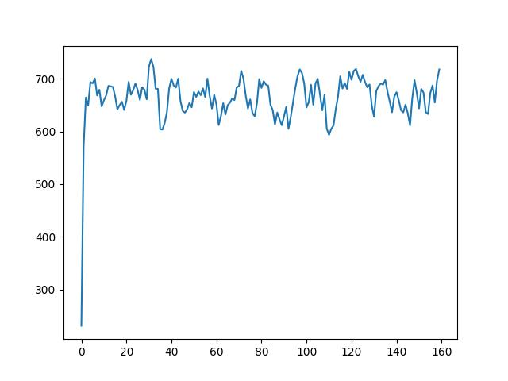

**第二阶段（约 4000+ 轮，从 checkpoint 续训）**：重新开始训练后跑了 4000+ 轮（累计 7000+ 轮）。结果显示各指标震荡严重、几乎没有收敛——频繁清空经验池导致模型每次都要重新适应新数据，训练不稳定，几乎"训崩"。

但与此同时，`Mean Reward` 波动的中心线从 1000 轮时的约 650 上升到了约 680~700，说明长周期训练并非完全没有效果，模型确实积累了一定的经验。

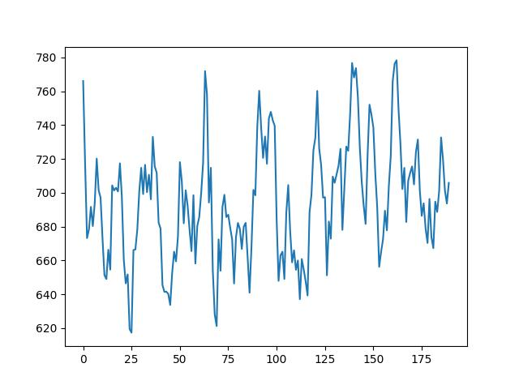
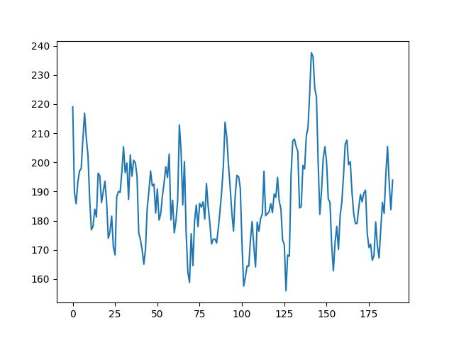
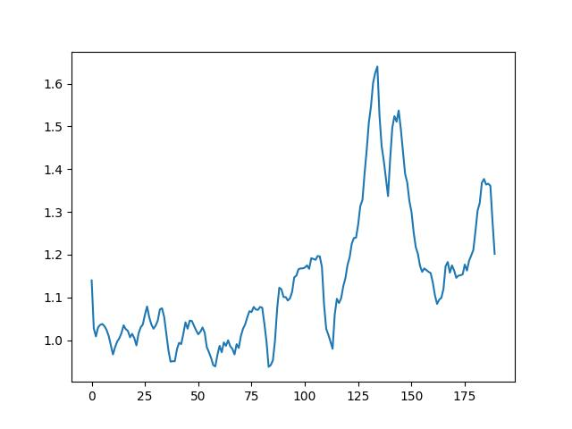
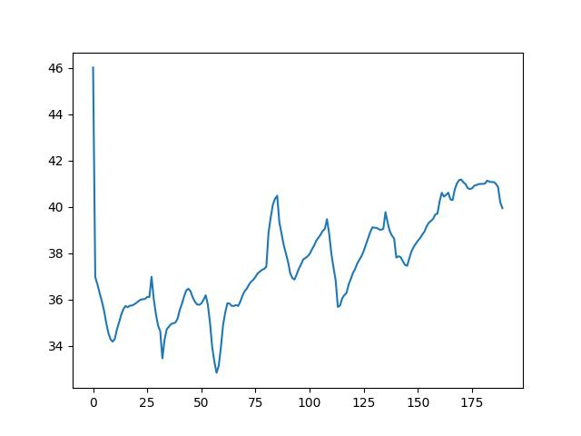

### 收敛分析

从 reward、Q 值、loss、length 四项指标综合看，长周期训练整体呈震荡状态，未观察到明确的收敛迹象：

- **Reward**：波动范围约 620~770，围绕 680~700 的中心线振荡，未形成稳定的上升或收敛趋势；
- **Q 值**：每次 checkpoint 清空经验池后迅速下降，随后缓慢回升，呈现周期性波动；
- **Loss**：波动同样剧烈，经验池更新后通常出现大幅下降，反映模型对新数据的适应过程；
- **Length**：总体呈下降态势，智能体趋向于用更短的步数完成游戏。

阶段划分：前 3000 轮训练相对平稳、Q 值与 loss 稳定上升，但深入分析发现此时 ε 仍然较大（训练至 7000 轮左右仍有约 0.7），智能体主要处于随机探索状态，指标的波动实质上反映的是探索行为的随机性，而非策略的实质性进步；经验池规模扩大后，采样耗时显著上升、早期样本对学习产生干扰，这一阶段促使了对经验池逻辑的重构。

### 实验反思与优化方向

1. **ε 衰减过慢是核心问题**：训练至 7000 轮时 ε 仍在 0.7 左右，智能体基本处于随机探索状态，极大限制了已学经验的有效利用。后续应加快衰减，使智能体更早进入利用（exploitation）阶段。
2. **频繁清空经验池是失败的尝试**：过于频繁地清空经验池会导致模型学习不稳定。更关键的是，"早期低质量数据有害"这一判断本身不准确——在 DQN 算法下，TD-target 由 reward 与冻结的 target 网络产生，经验数据保留的是环境在不同情形下的 reward 信息，DQN 正是依赖这些信息不断自我迭代，因此数据本身没有问题，保留更多数据反而能覆盖更多场景。
3. **save_every 需要平衡**：设置过大导致自我迭代缓慢；设置过小则造成"自己追自己"的局面，训练不稳定。
4. **下一步建议**：在 ε 衰减适宜、save_every 合理的配置下进行完整 10000+ 轮训练；保持经验池相对稳定（减少频繁清空，或仅随机清理部分），让模型有足够时间从环境反馈中持续学习。

### 实验记录对照表

以下运行记录对应本地 `checkpoints/` 目录（该目录未包含在仓库中），便于对照实验阶段：

| 本地运行目录 | 训练量 | 对应实验 |
| --- | --- | --- |
| 2026-05-19T17-51-33 | 100 episodes | 实验一（第一次，每 20 轮记录） |
| 2026-05-20T13-37-15 | 100 episodes | 实验一（第二次，每轮记录） |
| 2026-05-20T15-22-57 | 100 episodes | 实验二（固定种子基准） |
| 2026-05-20T16-17-38 | 320 episodes（中断） | 实验三（OOM 崩溃后重跑） |
| 2026-05-20T17-01-11 | 1000 episodes | 实验三（完整调优训练） |
| 2026-05-20T23-50-58 | 3180 episodes | 实验四第一阶段 |
| 2026-05-21T10-05-34 / 2026-05-21T11-13-39 | 520 + 3840 episodes | 实验四第二阶段（断点续训） |

## 快速开始

### 环境安装

```bash
conda env create -f environment.yml
conda activate mario-dqn
```

### 训练

```bash
python main.py --episodes 100 --gpu 0
```

`100` 仅用于快速验证代码能否正常运行。默认超参数按长周期训练设计，想看到明显效果通常需要上万 episode 或几十万到上百万步的训练。也可通过 `--seed` 固定随机种子、`--checkpoint` 断点续训。

### 回放训练好的模型

```bash
python replay.py --checkpoint checkpoints/your_run/mario_net_final.chkpt --gpu 0
```

## 目录结构

```
.
├── README.md              本文档
├── environment.yml        conda 环境定义
├── main.py                训练入口
├── agent.py               DQN 智能体（含三个核心函数与实验性优化）
├── neural.py              MarioNet：CNN 双网络定义
├── wrappers.py            环境预处理流水线
├── metrics.py             训练日志与曲线
├── compat.py              老版本依赖运行时兼容补丁
├── replay.py              加载 checkpoint 回放
├── original/
│   └── agent.py           策略C优化前的原版 agent.py（仅作对比参考）
└── docs/
    ├── Project4_Mario_RL_完整实验报告.pdf
    ├── 强化学习核心算法笔记.pdf
    └── figures/           各实验的训练曲线图
```

## 文档

- [完整实验报告](docs/Project4_Mario_RL_完整实验报告.pdf)：课程要求的完整实验报告（四组实验 + 收敛分析）
- [强化学习核心算法笔记](docs/强化学习核心算法笔记.pdf)：学习过程中整理的算法笔记
- [docs/figures](docs/figures/)：各实验的 reward / length / loss / Q 值曲线

> 说明：本项目为课程作业。`agent.py` 中标注的"策略C"优化属于实验性尝试，其中"保存 checkpoint 后清空经验池"的做法经实验验证反而导致训练不稳定，相关分析与反思详见[实验过程](#实验过程完整记录)与完整实验报告。
